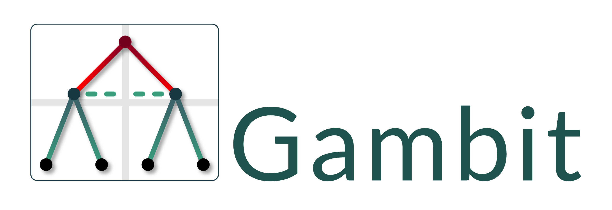

 

**Gambit** is the package for doing computation in (non-cooperative) game theory.

- **Documentation:** for the package is hosted at [gambitproject.readthedocs.io](https://gambitproject.readthedocs.io/).
- **The Gambit project:** Find out more about the project at [gambit-project.org](https://www.gambit-project.org/)
- **Contributors:** Please read the [code of conduct and contribution guidelines](https://gambitproject.readthedocs.io/en/latest/developer.contributing.html) before posting on GitHub.

Gambit provides:

- Structures to represent games in extensive and strategic form
- Methods for building and modifying games
- Representations of mixed strategy and mixed behavior profiles
- Many algorithms for computing one or more Nash equilibria of games
- Facilities for computing quantal response equilibria and fitting QREs to data

## How to get Gambit

Gambit's GitHub repository is at https://github.com/gambitproject/gambit.

Official Gambit releases are available from
[the releases section of the repository](https://github.com/gambitproject/gambit/releases)

Gambit offers [the Python package `pygambit`](https://pypi.org/project/pygambit/),
installable via PyPI.

## Contributors

<!-- ALL-CONTRIBUTORS-LIST:START - Do not remove or modify this section -->
<!-- prettier-ignore-start -->
<!-- markdownlint-disable -->
<table>
  <tbody>
    <tr>
      <td align="center" valign="top" width="14.28%"><a href="https://github.com/tturocy"> <b>Ted Turocy</b></a> <a href="#code-tturocy" title="Code">💻</a> <a href="#doc-tturocy" title="Documentation">📖</a> <a href="#research-tturocy" title="Research">🔬</a> <a href="#maintenance-tturocy" title="Maintenance">🚧</a> <a href="#ideas-tturocy" title="Ideas, Planning, & Feedback">🤔</a></td>
      <td align="center" valign="top" width="14.28%"><a href="http://www.csc.liv.ac.uk/~rahul"> <b>Rahul Savani</b></a> <a href="#code-rahulsavani" title="Code">💻</a> <a href="#doc-rahulsavani" title="Documentation">📖</a> <a href="#research-rahulsavani" title="Research">🔬</a> <a href="#maintenance-rahulsavani" title="Maintenance">🚧</a> <a href="#ideas-rahulsavani" title="Ideas, Planning, & Feedback">🤔</a></td>
    </tr>
    <tr>
      <td align="center" valign="top" width="14.28%"><a href="https://edchalstrey.com/"> <b>Ed Chalstrey</b></a> <a href="#code-edwardchalstrey1" title="Code">💻</a> <a href="#doc-edwardchalstrey1" title="Documentation">📖</a> <a href="#tutorial-edwardchalstrey1" title="Tutorials">✅</a></td>
      <td align="center" valign="top" width="14.28%"><a href="https://github.com/d-kad"> <b>Daniel </b></a> <a href="#research-d-kad" title="Research">🔬</a> <a href="#code-d-kad" title="Code">💻</a></td>
      <td align="center" valign="top" width="14.28%"><a href="https://github.com/StephenPasteris"> <b>StephenPasteris</b></a> <a href="#research-StephenPasteris" title="Research">🔬</a> <a href="#code-StephenPasteris" title="Code">💻</a></td>
    </tr>
  </tbody>
</table>

<!-- markdownlint-restore -->
<!-- prettier-ignore-end -->

<!-- ALL-CONTRIBUTORS-LIST:END -->
