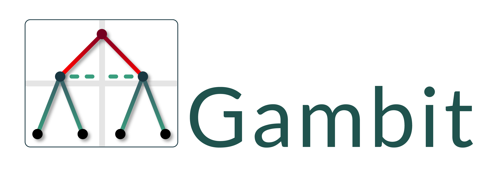

<br/>


Pre-release versions (alpha/beta/rc) are also published to PyPI and can be installed with
`pip install --pre pygambit`.


**Gambit** is the package for doing computation in (non-cooperative) game theory.

- **Documentation:** for the package is hosted at [gambitproject.readthedocs.io](https://gambitproject.readthedocs.io/).
- **The Gambit project:** Find out more about the project at [gambit-project.org](https://www.gambit-project.org/)
- **Contributors:** Please read the [code of conduct and contribution guidelines](https://gambitproject.readthedocs.io/en/latest/developer.contributing.html) before posting on GitHub.

Gambit provides:

- Structures to represent games in extensive and strategic form
- Methods for building and modifying games
- Representations of mixed strategy and mixed behavior profiles
- Many algorithms for computing one or more Nash equilibria of games
- Facilities for computing quantal response equilibria and fitting QREs to data


## How to get Gambit

Gambit's GitHub repository is at https://github.com/gambitproject/gambit.

Official Gambit releases are available from
[the releases section of the repository](https://github.com/gambitproject/gambit/releases)

Gambit offers [the Python package `pygambit`](https://pypi.org/project/pygambit/),
installable via PyPI:

```
pip install pygambit
```


## Contributors

<!-- ALL-CONTRIBUTORS-LIST:START - Do not remove or modify this section -->
<!-- prettier-ignore-start -->
<!-- markdownlint-disable -->
<table>
  <tbody>
    <tr>
      <td align="center" valign="top" width="14.28%"><a href="https://github.com/tturocy"><br /><sub><b>Ted Turocy</b></sub></a><br /><a href="https://github.com/gambitproject/gambit/commits?author=tturocy" title="Code">💻</a> <a href="https://github.com/gambitproject/gambit/commits?author=tturocy" title="Documentation">📖</a> <a href="https://github.com/tturocy" title="Research">🔬</a> <a href="https://github.com/tturocy" title="Maintenance">🚧</a> <a href="https://github.com/tturocy" title="Ideas, Planning, & Feedback">🤔</a></td>
      <td align="center" valign="top" width="14.28%"><a href="http://www.csc.liv.ac.uk/~rahul"><br /><sub><b>Rahul Savani</b></sub></a><br /><a href="https://github.com/gambitproject/gambit/commits?author=rahulsavani" title="Code">💻</a> <a href="https://github.com/gambitproject/gambit/commits?author=rahulsavani" title="Documentation">📖</a> <a href="https://github.com/rahulsavani" title="Research">🔬</a> <a href="https://github.com/rahulsavani" title="Maintenance">🚧</a> <a href="https://github.com/rahulsavani" title="Ideas, Planning, & Feedback">🤔</a></td>
      <td align="center" valign="top" width="14.28%"><a href="https://edchalstrey.com/"><br /><sub><b>Ed Chalstrey</b></sub></a><br /><a href="https://github.com/gambitproject/gambit/commits?author=edwardchalstrey1" title="Code">💻</a> <a href="https://github.com/gambitproject/gambit/commits?author=edwardchalstrey1" title="Documentation">📖</a> <a href="https://github.com/edwardchalstrey1" title="Tutorials">✅</a> <a href="https://github.com/edwardchalstrey1" title="Infrastructure (Hosting, Build-Tools, etc)">🚇</a></td>
      <td align="center" valign="top" width="14.28%"><a href="https://github.com/StephenPasteris"><br /><sub><b>StephenPasteris</b></sub></a><br /><a href="https://github.com/StephenPasteris" title="Research">🔬</a> <a href="https://github.com/gambitproject/gambit/commits?author=StephenPasteris" title="Code">💻</a></td>
      <td align="center" valign="top" width="14.28%"><a href="https://github.com/d-kad"><br /><sub><b>Daniel Kadnikov</b></sub></a><br /><a href="https://github.com/d-kad" title="Research">🔬</a> <a href="https://github.com/gambitproject/gambit/commits?author=d-kad" title="Code">💻</a></td>
      <td align="center" valign="top" width="14.28%"><a href="https://github.com/AndresFerCervell"><br /><sub><b>Andrés Fernández Cervell</b></sub></a><br /><a href="https://github.com/gambitproject/gambit/commits?author=AndresFerCervell" title="Code">💻</a></td>
      <td align="center" valign="top" width="14.28%"><a href="https://github.com/wyz2368"><br /><sub><b>wyz2368</b></sub></a><br /><a href="https://github.com/gambitproject/gambit/commits?author=wyz2368" title="Code">💻</a> <a href="https://github.com/wyz2368" title="Research">🔬</a></td>
    </tr>
    <tr>
      <td align="center" valign="top" width="14.28%"><a href="https://github.com/albertjiang"><br /><sub><b>Albert Xin Jiang</b></sub></a><br /><a href="https://github.com/gambitproject/gambit/commits?author=albertjiang" title="Code">💻</a></td>
      <td align="center" valign="top" width="14.28%"><a href="https://github.com/skunath"><br /><sub><b>S Kunath</b></sub></a><br /><a href="https://github.com/gambitproject/gambit/commits?author=skunath" title="Code">💻</a></td>
      <td align="center" valign="top" width="14.28%"><a href="https://github.com/andrioni"><br /><sub><b>Alessandro Andrioni</b></sub></a><br /><a href="https://github.com/gambitproject/gambit/commits?author=andrioni" title="Code">💻</a></td>
      <td align="center" valign="top" width="14.28%"><a href="https://github.com/EwoutH"><br /><sub><b>Ewout ter Hoeven</b></sub></a><br /><a href="https://github.com/EwoutH" title="Infrastructure (Hosting, Build-Tools, etc)">🚇</a> <a href="https://github.com/gambitproject/gambit/commits?author=EwoutH" title="Code">💻</a></td>
      <td align="center" valign="top" width="14.28%"><a href="https://github.com/ameliekleber"><br /><sub><b>ameliekleber</b></sub></a><br /><a href="https://github.com/gambitproject/gambit/commits?author=ameliekleber" title="Tests">⚠️</a></td>
    </tr>
  </tbody>
</table>

<!-- markdownlint-restore -->
<!-- prettier-ignore-end -->

<!-- ALL-CONTRIBUTORS-LIST:END -->
