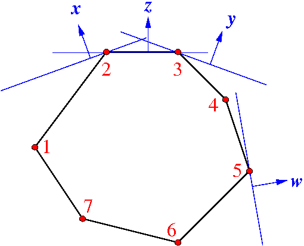

For contributors: Ideas and suggestions for Gambit-related projects
=====================================================================

Research on doing computation on finite games, and using numerical and
algorithmic methods to analyze games, are areas of quite active
research.  There are a number of opportunities for programmers of all
skill levels and backgrounds to contribute to improving and extending
Gambit.

A number of such ideas are outlined in this section.  They are grouped
by the areas of focus:

* :ref:`Interfaces (graphical and API) <contribute-interfaces>`
* :ref:`Testing and performance comparison <contribute-testing>`
* :ref:`Implementation of algorithms <contribute-algorithms>`

Each project includes a recommended/preferred
implementation language, and a summary of the background prerequisites
someone should have in order to take on the project successfully, in
terms of mathematics, game theory, and software engineering.

The `Gambit source tree <http://gambit.git.sourceforge.net/git/gitweb-index.cgi>`_
is managed using `git <http://www.git-scm.com>`_.  It is recommended to have some familiarity with how git works, or to be willing to learn.  (It's not that hard, and once you do learn it, you'll wonder how you ever lived without it.)

.. _contribute-interfaces:

Creating interfaces for game representations
--------------------------------------------

Implementing GUIs for user-friendly input, editing, and storage of game trees
^^^^^^^^^^^^^^^^^^^^^^^^^^^^^^^^^^^^^^^^^^^^^^^^^^^^^^^^^^^^^^^^^^^^^^^^^^^^^

This is a core project about the manipulation of game trees
with imperfect information, also called games in extensive
form.  It should extend the existing prototype
`<http://gametheoryexplorer.appspot.com/builder/>`_.

* **Languages:** Java and ActionScript (for Flex/Flashplayer)
* **Prerequisites:** Strong interest in expanding an existing code base for GUIs.
  Basic game theory.

Python API for manipulating games
^^^^^^^^^^^^^^^^^^^^^^^^^^^^^^^^^
Gambit's main API for representing games is written in C++.
There is a partial, experimental interface written using
`Cython <http://www.cython.org>`_ to allow games to be defined and manipulated using
Python.  Build out this interface to completion, and create
a test suite to exercise the interface, with special
emphasis on proper handling of error conditions.

* **Languages:** C++, Python via `Cython <http://www.cython.org>`_
* **Prerequisites:** Very rudimentary knowledge of game theory (which
  can be picked up as one goes along); some experience with
  creating Python extensions, preferably with Cython.

GUI for the input and manipulation of game models
^^^^^^^^^^^^^^^^^^^^^^^^^^^^^^^^^^^^^^^^^^^^^^^^^
This new project applies to other models of games, for example games on networks such as congestion games, and Parity games and stochastic games on graphs.

* **Languages:** Java and ActionScript (for Flex/Flashplayer),
  others if experience is there
* **Prerequisites:** Interest in game theory or logic, senior-level computer
  science or mathematics.

Conversion modules between game representations
^^^^^^^^^^^^^^^^^^^^^^^^^^^^^^^^^^^^^^^^^^^^^^^ 

Complex game representations such as game trees have different
serialization formats in Gambit such as the 
:ref:`.efg (extensive form game) format <file-formats>`
and a more recent XML format.  Utilities are to be written that convert one
format to the other in order to compare existing algorithms.  This can
be expanded from read-in methods for an internal representation of
existing algorithms.

* **Languages:** Python and Java
* **Prerequisites:** Some game theory, junior-level or higher background in
  computer science (data structures).

**Fuller details:**

In addition to the .efg file format, there is a .xml format
used by a new interactive program for drawing extensive form
games.  The program that accesses and generates this format,
under development as part of the Gambit project, is at

http://gametheoryexplorer.appspot.com/builder/

and a sample file reads::

    <extensiveForm>
      <node>
        <node player="1" prob="9/10">
          <node iset="2" player="2" move="B">
            <outcome move="N">
              <payoff player="1" value="3"/>
              <payoff player="2" value="1"/>
            </outcome>
            <outcome move="F">
              <payoff player="1" value="1"/>
              <payoff player="2" value="0"/>
            </outcome>
          </node>
          <node iset="4" player="2" move="Q">
            <outcome move="N">
              <payoff player="1" value="2"/>
              <payoff player="2" value="0"/>
            </outcome>
            <outcome move="F">
              <payoff player="1" value="1"/>
              <payoff player="2" value="0"/>
            </outcome>
          </node>
        </node>
        <node player="1" prob="1/10">
          <node iset="2" move="B">
            <outcome move="N">
              <payoff player="1" value="2"/>
              <payoff player="2" value="0"/>
            </outcome>
            <outcome move="F">
              <payoff player="1" value="0"/>
              <payoff player="2" value="1"/>
            </outcome>
          </node>
          <node iset="4" move="Q">
            <outcome move="N">
              <payoff player="1" value="3"/>
              <payoff player="2" value="1"/>
            </outcome>
            <outcome move="F">
              <payoff player="1" value="1"/>
              <payoff player="2" value="0"/>
            </outcome>
          </node>
        </node>
      </node>
    </extensiveForm>

which generates the game tree shown in this figure.

.. figure:: figures/beerquiche.*
            :figwidth: 33%
            :alt: a beer-quiche signaling game
            :align: right
            :target: _images/beerquiche.png

The project is about conversion between the  .xml  and .efg
formats, and should expand the existing read-in routines
that exist in the programs for the respective formats.  

.. _contribute-testing:

Creating testbeds for algorithms
--------------------------------

Create a regression-testing framework for Nash equilibrium solvers
^^^^^^^^^^^^^^^^^^^^^^^^^^^^^^^^^^^^^^^^^^^^^^^^^^^^^^^^^^^^^^^^^^
There are a number of different methods for computing Nash
equilibria in games.  Create a framework for exercising
algorithms on a set of games, and compare the output and
performance of the methods.  Some potential complications
include rounding problems with floating-point numbers, and
that some methods only promise to return a subset of the
equilibria.  The framework should accommodate the ability
both to compare different methods, and to do regression
testing.

* **Languages:** Open; Python is likely the best option
* **Prerequisites:** Interest in testing frameworks

Creating interfaces to cloud computing
^^^^^^^^^^^^^^^^^^^^^^^^^^^^^^^^^^^^^^

Algorithms with long running times can be tested fast only
with cloud computing.  Recording the computational
experiments requires scripting and output data management, 
and interfacing the cloud computing environment.

* **Languages:** Python
* **Prerequisites:** Experience with cloud computing desirable.

Record-keeping and display of results for computational experiments
^^^^^^^^^^^^^^^^^^^^^^^^^^^^^^^^^^^^^^^^^^^^^^^^^^^^^^^^^^^^^^^^^^^

Developing a systematic way of organizing and maintaining the results of computational experiments in a database.  This requires book-keeping of programs together with their versions, and of corresponding possibly randomly generated data.  Creating modules for graphical and tabular representation of results from the database.  There may be existing packages of this sort around that are to be found, configured and adapted.

* **Languages:** Python, SQL in suitable variant, possibly via 
  `SQLAlchemy <http://www.sqlalchemy.org>`_.
* **Prerequisites:**  Experience with scripting and data
  representation desirable.

.. _contribute-algorithms:

Implementing algorithms for finding equilibria in games
-------------------------------------------------------

Improve integration and testing of Gametracer
^^^^^^^^^^^^^^^^^^^^^^^^^^^^^^^^^^^^^^^^^^^^^

Gambit incorporates the 
`Gametracer <http://dags.stanford.edu/Games/gametracer.html>`_ package
to provide
implementations of two methods for computing equilibria,
:ref:`gambit-gnm <gambit-gnm>` and :ref:`gambit-ipa <gambit-ipa>`.
The integration
is rather crude, as internally the program converts the game
from native Gambit representation into Gametracer's
representation, and the converts the output back.  Using
Gametracer's implementations as a starting point, refactor
the implementation to use Gambit's native classes directly,
and carry out experiments on the reliability and performance
of the algorithms.

* **Languages:** C++
* **Prerequisites:** Some level of comfort with linear algebra;
  enjoyment of refactoring code.
 
Finding all equilibria reachable by Lemke-Howson
^^^^^^^^^^^^^^^^^^^^^^^^^^^^^^^^^^^^^^^^^^^^^^^^

For a two-player in strategic form (also called bimatrix
games), what are the Nash equilibria that can be found using
the Lemke-Howson method?  Each pure strategy as an
"initially dropped label" leads to an equilibrium along a
computational path obtained by "pivoting" in a linear
system.  If two equilibria found in that way are different,
using the second label on the first equilibrium (and vice
versa) will find yet another equilibrium.  The set of all
equilibria reachable in that way should be recorded and is a
(normally) fast way to find many equilibria when the game is
large.

* **Languages:** Java
* **Prerequisites:**
  Theoretical understanding of the Lemke-Howson
  method or of the Simplex algorithm for Linear Programming.
  Literature exists that is accessible for students with at
  least senior-level background in computer science,
  mathematics or operations research.  An existing
  implementation of a Lemke-Howson style pivoting algorithm
  should be adapted with suitable alterations.

**Fuller details:**

This figure shows the typical situation for a nondegenerate
two-player game:

.. figure:: figures/lh-net.*
            :alt: a two-player game
	    :align: center

There is an "artificial equilibrium" 0 and five equilibria
1,2,3,4,5, each of which has a *sign* or *index* + or -.
The Lemke-Howson (LH) algorithm computes a piecewise linear
path from a known equilibrium, originally only 0, to another
equilibrium.  There are different ways to start, one for
each pure strategy of a player which define different LH
paths.  Here only two ways are shown, in blue and red. 
An LH path always connects two equilibria of opposite sign,
so there are an even number of them, minus the artificial
equilibrium, which gives an odd number overall.  
Here, the blue and red paths lead to two different
equilibria 1 and 2 of positive index (+).  Then the
algorithm can be run backwards on equilibrium 1 where the
blue path leads back to 0, but the red path must find
another equilibrium, here 3, of negative index (-).  
The blue path from equilibrium 2 could possibly find another
negatively indexed equilibrium like 4, but does not, it also
finds 3.  So the "network" of LH paths here is not connected
and only finds equilibria 1,2,3, but not the two equilibria
4,5 which are only connected among themselves.

Given the LH algorithm, all this is relatively
straightforward, but there is no implementation for finding
negatively indexed equilibria and the described "network".
It would also be useful to study if all equilibria can be
found for random or typical examples.

The LH algorithm is described in

    B. von Stengel (2007), Equilibrium computation for
    two-player games in strategic and extensive form. Chapter 3,
    Algorithmic Game Theory, eds. N. Nisan, T. Roughgarden, E.
    Tardos, and V. Vazirani, Cambridge Univ. Press, Cambridge,
    53-78. 

    http://www.maths.lse.ac.uk/Personal/stengel/TEXTE/agt-stengel.pdf

It is related to the simplex algorithm for linear
programming but with a different *complementary* pivoting
rule.  It is also numerically not stable because rounding
errors may violate the rule, so it needs to be implemented
with *integer pivoting*, also described in the article.

There are versions around in C and Java that implement this
which are not yet part of the public Gambit code, but will
be made public once the project starts.

Finding equilibria reachable by Lemke's algorithm with varying "covering vectors"
^^^^^^^^^^^^^^^^^^^^^^^^^^^^^^^^^^^^^^^^^^^^^^^^^^^^^^^^^^^^^^^^^^^^^^^^^^^^^^^^^

Related to the Lemke-Howson method above, but with a
slightly different algorithm that has an extra parameter,
called the "covering vector".  That parameter can serve a
randomly selected starting point of the computation and
potentially reach many more equilibria.

* **Languages:** Java
* **Prerequisites:** Theoretical understanding of the Lemke-Howson
  method or of the Simplex algorithm for Linear Programming.
  Literature exists that is accessible for students with at
  least senior-level background in computer science,
  mathematics or operations research.  An existing
  implementation of a Lemke-Howson style pivoting algorithm
  should be adapted with suitable alterations.

Computing the index of an equilibrium component
^^^^^^^^^^^^^^^^^^^^^^^^^^^^^^^^^^^^^^^^^^^^^^^

The task is to implement a published algorithm to compute
the so-called index of an equilibrium component in a
bimatrix game.  This component is the output to an existing
enumeration algorithm.

* **Languages:** Java and C
* **Prerequisites:**  Senior-level mathematics, interest in game theory
  and some basic topology.

**Fuller details:**

The aim of this project is to implement an existing
algorithm that finds the index of an equilibrium component.
The relevant description of this is chapter 2 of 

    Anne Balthasar, Geometry and Equilibria in Bimatrix Games,
    PhD Thesis, London School of Economics, 2009. 

    http://www.maths.lse.ac.uk/Personal/stengel/phds/#anne

which are pages 21-41 of
    http://www.maths.lse.ac.uk/Personal/stengel/phds/anne-final.pdf

The mathematics in this chapter are pretty scary (in
particular section 2.2, which is however not needed) but the
final page 41 which describes the algorithm is less scary.

Nevertheless, this is rather advanced material because it
builds on several different existing algorithms (for finding
extreme equilibria in bimatrix games, and "cliques" that
define convex sets of equilibria, and their non-disjoint
unions that define "components").  It requires the
understanding of what equilibria in bimatrix games are
about.  These algorithms are described in

    D. Avis, G. Rosenberg, R. Savani, and B. von Stengel (2010),
    Enumeration of Nash equilibria for two-player games.
    Economic Theory 42, 9-37. 

    http://www.maths.lse.ac.uk/Personal/stengel/ETissue/ARSvS.pdf

and students who do not eventually understand that text
should not work on this project.  For this reason, at least
senior-level (= third year) mathematics is required in terms of
mathematical maturity.  In the Avis et al. (2010) paper,
pages 19-21 describe the lexicographic method for pivoting
as it is used in the simplex method for linear programming.
A variant of this lexicographic method is used in the
chapter by Anne Balthasar.  Understanding this is a
requirement to work on this project (and a good test of how
accessible all this is).

We give here two brief examples that supplement the above
literature.  Consider the following bimatrix game.  It is
very simple, and students of game theory may find it useful
to first find out on their own what the equilibria of this
game are::

    2 x 2 Payoff matrix A:

    1  1
    0  1

    2 x 2 Payoff matrix B:

    1  1
    0  1

    EE = Extreme Equilibrium, EP = Expected Payoff

    EE  1  P1:  (1)  1  0  EP=  1  P2:  (1)  1  0  EP=  1
    EE  2  P1:  (1)  1  0  EP=  1  P2:  (2)  0  1  EP=  1
    EE  3  P1:  (2)  0  1  EP=  1  P2:  (2)  0  1  EP=  1

    Connected component 1:
    {1, 2}  x  {2}
    {1}  x  {1, 2}

This shows the following:  there are 3 Nash equilibria,
which partly use the same strategies of the two players,
which are numbered (1), (2)  for each player.  It will take
a bit of time to understand the above output.  For our
purposes, the bottom "component" is most relevant:
It has two lines, and  {1, 2}  x  {2}   means
that equilibrium (1),(2)  -  which is according to the
previous list the strategy pair (1,0), (1,0)  as well as
(2),(2),   which is   (0,1), (1,0)  are "extreme
equilibria", and moreover any convex combination of (1) and
(2) of player 1  - this is the first {1, 2} - can be
combined with strategy (2) of player 2.
This is part of the "clique" output of Algorithm 2 on page
19 of Avis et al. (2010).
There is a second such convex set of equilibria in the
second line, indicated by {1}  x  {1, 2}.
Moreover, these two convex sets intersect (in the
equilibrium  (1),(2))  and form therefore a "component" of
equilibria.  For such a component, the index has to be
found, which happens to be the integer 1 in this case.

The following bimatrix game has also two convex sets of Nash
equilibria, but they are disjoint and therefore listed as
separate components on their own::

    3 x 2 Payoff matrix A:

    1  1
    0  1
    1  0

    3 x 2 Payoff matrix B:

    2  1
    0  1
    0  1

    EE = Extreme Equilibrium, EP = Expected Payoff

    Rational Output

    EE  1  P1:  (1)    1    0    0  EP=  1  P2:  (1)  1  0  EP= 2
    EE  2  P1:  (2)  1/2  1/2    0  EP=  1  P2:  (2)  0  1  EP= 1
    EE  3  P1:  (3)  1/2    0  1/2  EP=  1  P2:  (1)  1  0  EP= 1
    EE  4  P1:  (4)    0    1    0  EP=  1  P2:  (2)  0  1  EP= 1

    Connected component 1:
    {1, 3}  x  {1}

    Connected component 2:
    {2, 4}  x  {2}

Here the first component has index 1 and the second has
index 0.  One reason for the latter is that if the game is
slightly perturbed, for example by giving a slightly lower
payoff than 1 in row 2 of the game, then the second strategy
of player 1 is strictly dominated and the equilibria (2) and
(4) of player 1, and thus the entire component 2, disappear
altogether.  This can only happen if the index is zero, so
the index gives some useful information as to whether an
equilibrium component is "robust" or "stable" when payoffs
are slightly perturbed.

Enumerating all equilibria of a two-player game tree
^^^^^^^^^^^^^^^^^^^^^^^^^^^^^^^^^^^^^^^^^^^^^^^^^^^^

Extension of an existing algorithm for enumerating all
equilibria of a bimatrix game to game trees with imperfect
information using the so-called "sequence form".  The method
is described in abstract form but not implemented.  

* **Languages:** Java
* **Prerequisites:** Background in game theory and basic linear
  algebra.  Experience with Java programs of at least
  medium complexity so that existing code can be expanded.

Solving for equilibria using polynomial systems of equations
^^^^^^^^^^^^^^^^^^^^^^^^^^^^^^^^^^^^^^^^^^^^^^^^^^^^^^^^^^^^

The set of Nash equilibrium conditions can be expressed as a
system of polynomial equations and inequalities.  The field
of algebraic geometry has been developing packages to
compute all solutions to a system of polynomial equations.
Two such packages are 
`PHCpack <http://www.math.uic.edu/~jan/download.html">`_ and 
`Bertini <http://www.nd.edu/~sommese/bertini/>`_.  
Gambit has an
experimental interface, written in Python, to build the
required systems of equations, call out to the solvers, and
identify solutions corresponding to Nash equilibria.
Refactor the implementation to be more flexible and
Pythonic, and carry out experiments on the reliability and
performance of the algorithms.

* **Languages:** Python
* **Prerequisites:** Experience with text processing to pass data to
  and from the external solvers.

Implement Herings-Peeters homotopy algorithm to compute Nash equilibria
^^^^^^^^^^^^^^^^^^^^^^^^^^^^^^^^^^^^^^^^^^^^^^^^^^^^^^^^^^^^^^^^^^^^^^^

Herings and Peeters 
(`Economic Theory, 18(1), 159-185, 2001 <http://dx.doi.org/10.1007/PL00004129>`_) have proposed a
homotopy algorithm to compute Nash equilibria.  They have
created a
`first implementation of the method in Fortran <http://www.personeel.unimaas.nl/r.peeters/software.htm>`_,
using `hompack <http://www.netlib.org/hompack/>`_.
Create a Gambit implementation of this method, and carry out
experiments on the reliability and performance of the
algorithms.

* **Languages:** C/C++, ability to at least read Fortran
* **Prerequisites:** Basic game theory and knowledge of pivoting
  algorithms like the Simplex method for Linear Programming or
  the Lemke-Howson method for games.  Senior-level
  mathematics, mathematical economics, or operations research.

Representing two-player correlated equilibrium payoffs
^^^^^^^^^^^^^^^^^^^^^^^^^^^^^^^^^^^^^^^^^^^^^^^^^^^^^^

For a game, the set of correlated equilibria is a convex
polytope. For a two-player game, the set of its payoffs is
a two-dimensional polygon.  This is useful information to
draw as a first picture of which equilibrium payoffs can be expected.

* **Languages:** Python, Java, or C/C++
* **Prerequisites:** Some knowledge of game theory and linear programming.

**Fuller details:**

Correlated equilibrium (CE) is a generalization of Nash
equilibrium.  For a definition see
http://en.wikipedia.org/wiki/Correlated_equilibrium

For any number of players, the set of CE is a polytope. The
"variables" of this polytope are the probabilities of a
joint distribution over strategy profiles.  Linear
inequalities that define this polytope are "incentive
constraints" that compare any two strategies of a player,
and are derived from the payoffs of the game.
Consequently, one can maximize a linear function over this
polytope by linear programming, for example any linear
combination of the players' payoffs. 

In a two-player game, the possible *payoffs* for the two
players in a CE define a polygon.
(For three players, they define a polytope of dimension
three, and so on.)
These payoffs give useful information about the game, for
example which Nash equilibrium payoffs - which are special
CE payoffs - can at most be expected.
What is unknown about the polygon are its *vertices*.
The following picture shows a polygon with 7 vertices
numbered 1,2,...,7.  

In this figure, if the horizontal direction is the payoff to
player 1 and the vertical direction is the payoff to player 2, 
then vertices 5 and 1 are the CE with maximum (minimum)
payoff to player 1, vertices 2 and 3 give maximum payoff to
player 2, and vertex 6 gives minimum payoff to player 2. 

How can one identify the vertices when the only access to
the polygon is via maximizing linear functions of the two
coordinates?  By trying out different directions
intelligently.  Maximizing in direction x gives vertex 2,
maximizing in direction y gives vertex 3.  If the linear
function z that is orthogonal to the line that connects 2
and 3 is maximized at both 2 and 3, then there is no further
vertex between them.  For comparison, suppose direction w is
maximized at 5.  Then the line that connects 3 and 5 gives
a direction (not shown) that is *not* maximized at both 3
and 5, but instead yields another vertex 4.  This should
give a quick picture of the possible CE payoffs.
(Extending this to 3 players is a whole new challenge, and
would require interfacing with 3D-drawing programs, if this
is worth pursuing.)

The possible CE payoffs can be used as bounds in the search
for Nash equilibria in enumeration programs such as those
described in

    D. Avis, G. Rosenberg, R. Savani, and B. von Stengel (2010),
    Enumeration of Nash equilibria for two-player games.
    Economic Theory 42, 9-37. 

    http://www.maths.lse.ac.uk/Personal/stengel/ETissue/ARSvS.pdf

which may be a useful interface (that would have to be
tested for its usefulness) to equilibrium enumeration.
 

